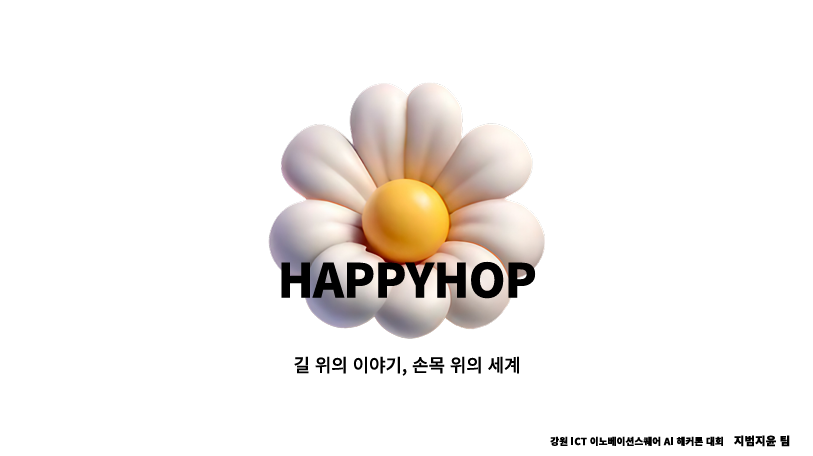
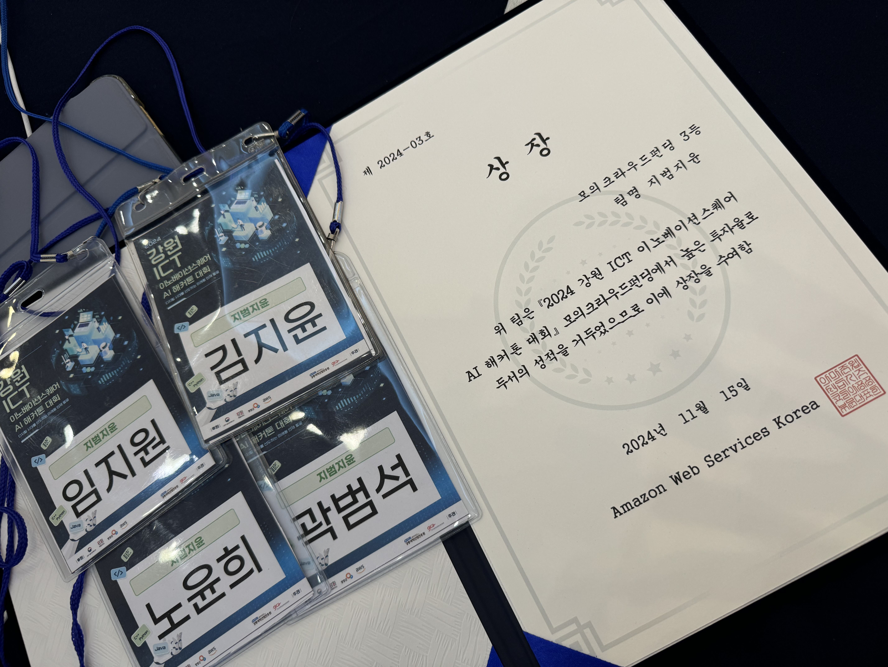
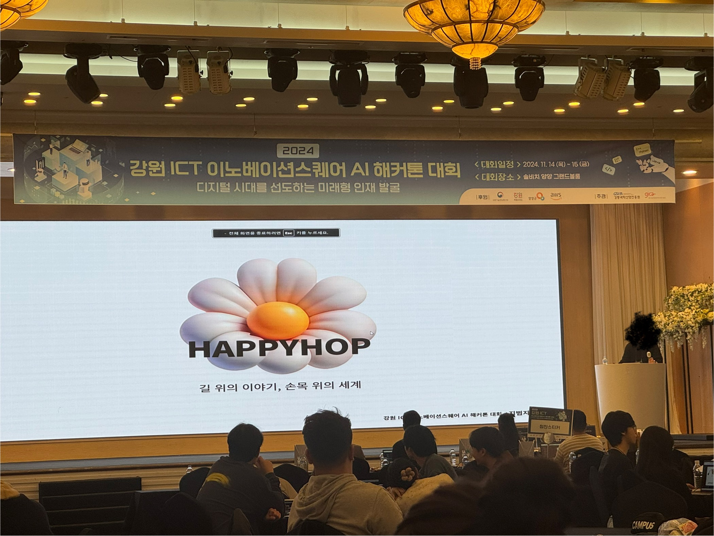
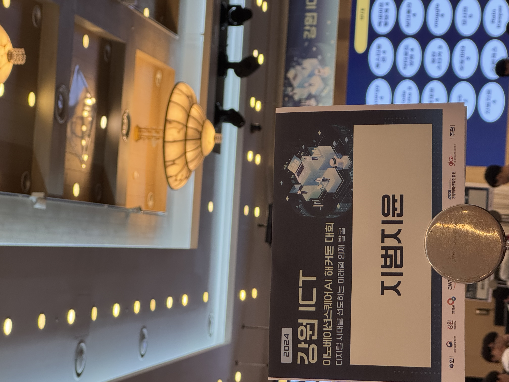

  

# HAPPYHOP – AI 아이디어 해커톤 3등 수상작

🏆 **2024 강원 ICT 이노베이션스퀘어 AI 해커톤 – 모의크라우드펀딩 부문 3등 수상**

---

## 📌 프로젝트 소개

**HAPPYHOP**은 스마트워치와 AI 기술을 활용하여  
사용자의 위치 정보와 감정 데이터를 기반으로 여행 리포트를 생성하고  
커뮤니티와 연결하는 관광 플랫폼 아이디어입니다.

---

## 🧠 핵심 기능 요약

- 스마트워치 기반 위치 수집 및 감정 기록
- 위치 기반 랜드마크 생성
- 관광 및 감정 데이터 기반 AI 여행 리포트 생성
- NLP 기술 기반 리뷰 추천

---

## 🎯 내 역할

- 👤 팀장: 지범지윤
- 💡 아이디어 기획 및 구조 설계
- 🖥️ 발표자료 제작 및 시연 흐름 구성
- 🌐 클라우드 펀딩 사이트에 올려 모의 펀딩 진행

---

## 📄 발표자료 및 산출물

- 👉 [📂 발표자료 다운로드 (PDF)](./HAPPYHOP_발표자료.pdf)  
- 👉 [🌐 클라우드 펀딩 페이지 보기 (PDF)](./HAPPYHOP_클라우드펀딩_페이지.pdf)

---

## 🖼️ 현장 이미지

| 상장 | 발표 장면 | 이름표 인증 |
|------|------------|----------------|
|  |  |  |

> 🤫 팀원 얼굴은 모자이크 처리했습니다.

---

## 🏁 수상 결과

- 📅 2024.11.15 개최  
- 🏢 주관: 강릉과학산업진흥원, 강원정보문화산업진흥원
- 🏆 수상: **모의크라우드펀딩 부문 3등**

---

## 📝 회고록

👉 [벨로그 회고 보기](https://velog.io/@sdg3729/HappyHop-hackathon-ai-tour)

---

## 🛠 사용 기술

---

## 📌 프로젝트 요약용 키워드

`#AI해커톤` `#스마트워치` `#감정기반AI여행리포트` `#관광플랫폼` `#모의펀딩수상작`
